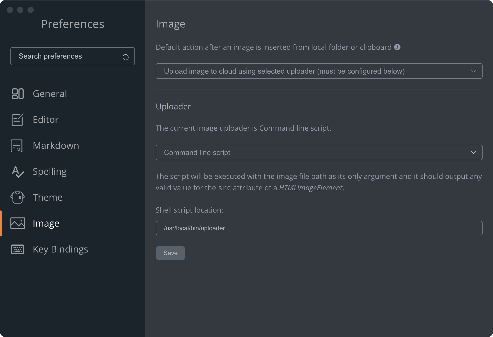

# r2-uploader
[](https://github.com/nagaame/r2-uploader/actions/workflows/go.yml)
[](https://github.com/nagaame/r2-uploader/releases/latest)

this uploader is the [CF-R2-ImageBed/uploader](https://github.com/cmj2002/CF-R2-ImageBed/tree/main/uploader) simple implement by golang for [marktext](https://github.com/marktext/marktext).

usage:

specify and load executable files.



compile:

```go
go build -v ./...
```
